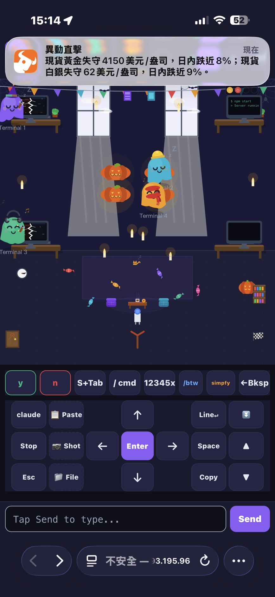

# GhostTerm

Control [Claude Code](https://docs.anthropic.com/en/docs/claude-code) from your phone. A mobile-optimized web terminal that connects to your PC over [Tailscale](https://tailscale.com/).

No cloud relay, no port forwarding, no account needed. Your terminal stays on your machine — your phone just drives it.

<p align="center">
  
  
  
</p>

## Why

Claude Code is a CLI tool. If you're away from your desk — on the couch, in bed, commuting — you can't use it. GhostTerm gives you a full terminal on your phone with controls designed for touch.

## Features

- **Full terminal** — xterm.js with touch-friendly D-pad, quick buttons (y/n/Enter/Tab/Esc), and text input
- **Multi-session** — up to 4 Claude Code sessions, switch instantly
- **Smart reconnect** — delta sync on reconnect, no screen flicker
- **File upload** — take a photo or pick a file from your phone, it lands on your PC
- **Screenshot** — capture the terminal and save it
- **Pixel office** — cute ghost animations that show what each session is doing (idle, busy, waiting, error)
- **PWA** — add to home screen for a native app feel
- **iOS keyboard handling** — solved all the Safari viewport quirks so the keyboard just works

<p align="center">
  
</p>

## Prerequisites

1. **[Tailscale](https://tailscale.com/)** installed on both your PC and phone, both logged into the same tailnet
2. **Node.js** 18+ on your PC
3. **Claude Code** installed on your PC (`npm install -g @anthropic-ai/claude-code`)

## Setup

```bash
git clone https://github.com/chengwaye/ghostterm.git
cd ghostterm
npm install
npm start
```

On startup, a QR code appears in the terminal. Scan it with your phone (both devices must be on Tailscale).

The server binds only to your Tailscale IP (`100.x.x.x`) — it is **not** accessible from the public internet.

## Configuration

| Variable | Default | Description |
|----------|---------|-------------|
| `PORT` | `3777` | Server port |
| `ACCESS_CODE` | _(none)_ | Optional passcode to protect access |

```bash
ACCESS_CODE=mysecret npm start
```

## How it works

```
Phone (Safari/Chrome)          Tailscale VPN           Your PC
┌─────────────────┐      ┌──────────────────┐    ┌──────────────┐
│  xterm.js +     │◄────►│  Encrypted       │◄──►│  server.js   │
│  touch controls │      │  WireGuard tunnel│    │  + node-pty  │
│  (Socket.IO)    │      │                  │    │  + Express   │
└─────────────────┘      └──────────────────┘    └──────────────┘
```

- `server.js` spawns real PTY sessions via `node-pty`
- Socket.IO streams terminal I/O between phone and PC
- Delta sync: on reconnect, only the missed bytes are sent (no full refresh)
- Server auto-detects your Tailscale IP and binds only to it

## Security

- **LAN only** — binds to Tailscale IP, not `0.0.0.0`
- **No cloud** — direct encrypted connection via WireGuard (Tailscale)
- **Optional passcode** — set `ACCESS_CODE` to require a code on connect
- **No data leaves your network** — terminal I/O never touches the internet

## Platform support

- **Server**: Windows, macOS, Linux (anywhere `node-pty` works)
- **Client**: iOS Safari, Android Chrome, any mobile browser
- Best tested on iOS Safari — all viewport/keyboard quirks are handled

## License

MIT
