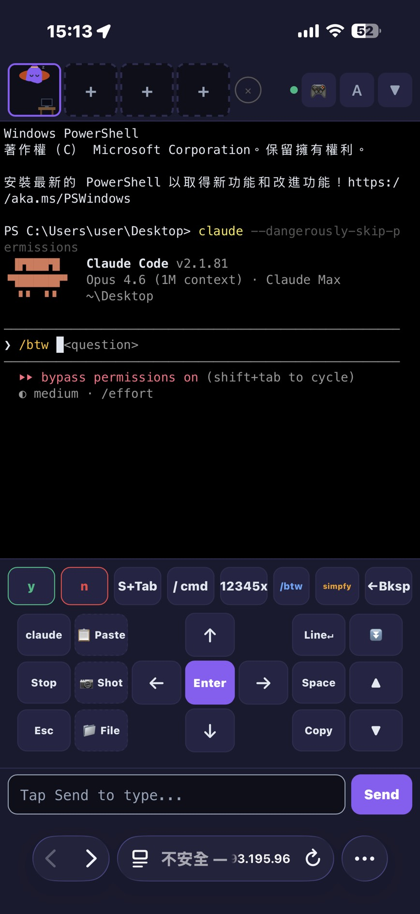
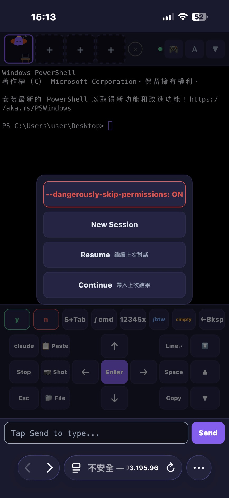
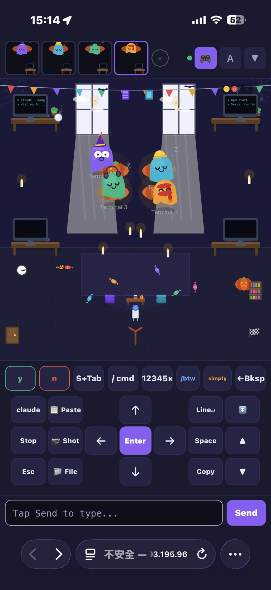
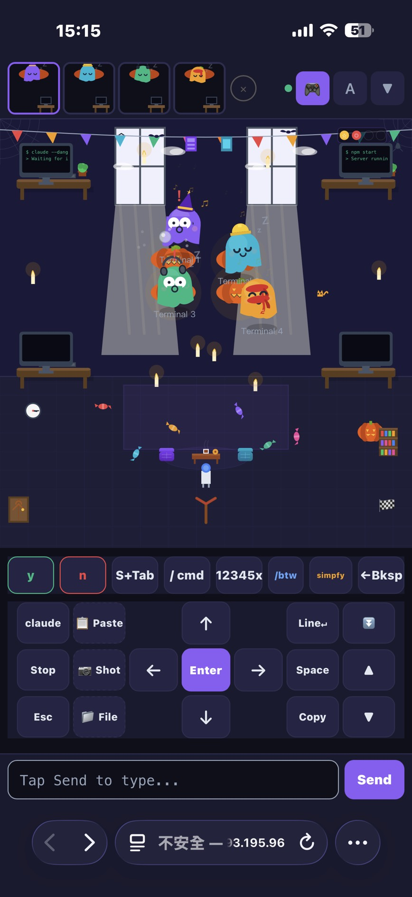

# GhostTerm

[English](README.md)

用手機遙控電腦上的 [Claude Code](https://docs.anthropic.com/en/docs/claude-code)。透過 [Tailscale](https://tailscale.com/) 私有加密網路連線，不需要雲端伺服器、不用開 port、不用註冊帳號。

終端機留在你的電腦上，手機只是遙控器。

<p align="center">
  
  
  
</p>

## 為什麼需要這個

Claude Code 是命令列工具，離開電腦就沒辦法用。GhostTerm 讓你躺在沙發上、通勤的時候，都能用手機操控電腦上的 Claude Code 幫你寫程式。

**核心賣點**：按一下 `claude` 按鈕就能啟動 `--dangerously-skip-permissions` 模式，Claude Code 全自動執行，不會跳確認提示。你在手機上遙控一個 AI Agent，它在電腦上寫 code。

## 功能

- **完整終端** — xterm.js 終端 + 觸控方向鍵、快捷按鈕（y/n/Enter/Tab/Esc）、文字輸入
- **Claude Code 整合** — 一鍵啟動，支援 `--dangerously-skip-permissions` 開關，全自動寫 code
- **多 Session** — 最多同時跑 4 個 Claude Code，即時切換
- **智慧重連** — 切到其他 App 再回來，差量同步不閃屏，畫面完整保留
- **檔案上傳** — 手機拍照或選檔，直接傳到電腦。一鍵貼上路徑給 Claude Code
- **截圖** — 擷取終端畫面存到電腦
- **像素辦公室** — 可愛的幽靈動畫，顯示每個 Session 的狀態（閒置、忙碌、等待、錯誤）
- **PWA** — 加到主畫面，像原生 App 一樣全螢幕使用
- **iOS 鍵盤完美處理** — Safari 的 viewport 跳動問題全部解決

<p align="center">
  
</p>

## 事前準備

1. **[Tailscale](https://tailscale.com/)** 裝在電腦和手機上（個人使用免費）
2. **Node.js** 18 以上（裝在電腦）
3. **Claude Code** 裝在電腦（`npm install -g @anthropic-ai/claude-code`）

## Tailscale 設定教學

Tailscale 會在你的裝置之間建立私有加密網路，不需要設定防火牆或 port forwarding。

1. **註冊** — 到 [tailscale.com](https://tailscale.com/) 註冊帳號（個人免費，最多 100 台裝置）

2. **電腦安裝**
   - Windows：到 [tailscale.com/download](https://tailscale.com/download) 下載安裝
   - macOS：`brew install tailscale` 或從官網下載
   - Linux：`curl -fsSL https://tailscale.com/install.sh | sh`

3. **手機安裝**
   - iOS：[App Store](https://apps.apple.com/app/tailscale/id1470499037)
   - Android：[Google Play](https://play.google.com/store/apps/details?id=com.tailscale.ipn)

4. **兩邊都用同一個帳號登入**（Google、Microsoft 或 GitHub）

5. **驗證** — 在電腦上執行：
   ```bash
   tailscale ip
   ```
   會看到一個 `100.x.x.x` 的 IP，這就是你的 Tailscale IP。手機不管在家裡 WiFi、行動網路、咖啡廳，都能連到這個 IP。

搞定。你的手機和電腦現在在同一個私有網路上了。

## 安裝與啟動

```bash
git clone https://github.com/chengwaye/ghostterm.git
cd ghostterm && npm install && npm start
```

啟動後會看到：

```
=================================
  Claude Remote Control
=================================
  Local:  http://localhost:3777
  Mobile: http://100.x.x.x:3777
=================================

Scan with your phone:
▄▄▄▄▄▄▄▄▄▄▄▄▄▄▄
█ ▄▄▄▄▄ █ █ ...
```

用手機掃 QR Code，或直接輸入 Mobile 網址。

> **小技巧**：iOS 上按分享 > 加入主畫面，就能當全螢幕 App 用。

## 使用 Claude Code

1. 按左下角的 **`claude`** 按鈕，會彈出選單：
   - **`--dangerously-skip-permissions: ON/OFF`** — 最上面的開關。開啟後 Claude Code 不會每次改檔案、跑指令都問你，適合遠端操作（不然用手機一直按 y 很煩）
   - **New Session** — 開新的 Claude Code 對話
   - **Resume** — 接續上次對話
   - **Continue** — 帶入上次結果繼續

2. 在最下面的輸入框打字，按 **Send** 送出

3. 用 **y** / **n** 快速確認，**↑↓←→** 方向鍵導航，**Tab** / **Shift+Tab** 切換 Claude Code 的 UI 選項

4. 最多可以同時跑 **4 個 Session** — 每個都有自己的小幽靈。按頂部的 `+` 建立新 Session

## 設定

| 環境變數 | 預設值 | 說明 |
|---------|--------|------|
| `PORT` | `3777` | 伺服器 port |
| `ACCESS_CODE` | （無） | 連線密碼，選填 |

```bash
ACCESS_CODE=mysecret npm start
```

## 運作原理

```
手機 (Safari/Chrome)           Tailscale VPN           你的電腦
┌─────────────────┐      ┌──────────────────┐    ┌──────────────┐
│  xterm.js +     │◄────►│  WireGuard       │◄──►│  server.js   │
│  觸控操作介面    │      │  加密隧道         │    │  + node-pty  │
│  (Socket.IO)    │      │                  │    │  + Express   │
└─────────────────┘      └──────────────────┘    └──────────────┘
```

- `server.js` 透過 `node-pty` 建立真正的 PTY 終端
- Socket.IO 在手機和電腦之間串流終端 I/O
- 差量同步：重連時只補傳遺漏的部分，不重刷整個畫面
- 自動偵測 Tailscale IP，只綁定在上面

## 安全性

- **僅限內網** — 只綁 Tailscale IP，不綁 `0.0.0.0`，公網完全不可見
- **不經過雲端** — 透過 WireGuard 直連加密，沒有中間伺服器
- **可設密碼** — 設定 `ACCESS_CODE` 環境變數即可
- **資料不出網路** — 終端 I/O 只在手機和電腦之間傳輸

## 支援平台

- **伺服器端**：Windows、macOS、Linux（只要 `node-pty` 能跑的地方）
- **手機端**：iOS Safari、Android Chrome、任何手機瀏覽器
- iOS Safari 上測試最完整 — 所有 viewport / 鍵盤問題都處理好了

## 授權

MIT
